# All About Penguins

All About Penguins is a site that aims to provide information about penguins. It is designed to cater for a range of users by providing some scientific data, a gallery of images and video that are both educational and enjoyable to look at, and some interesting facts alongside a contact form to submit further questions. The website is structured around user needs by providing a landing page that contains the basic information, a gallery page for users who are interested in images and a trivia page that includes interesting facts and a contact form for user questions.

The site has been created for the first milestone project for Code Institute's Diploma in Full Stack Software Development.

You can visit the live website [here](https://frankiesanjana.github.io/all-about-penguins/).

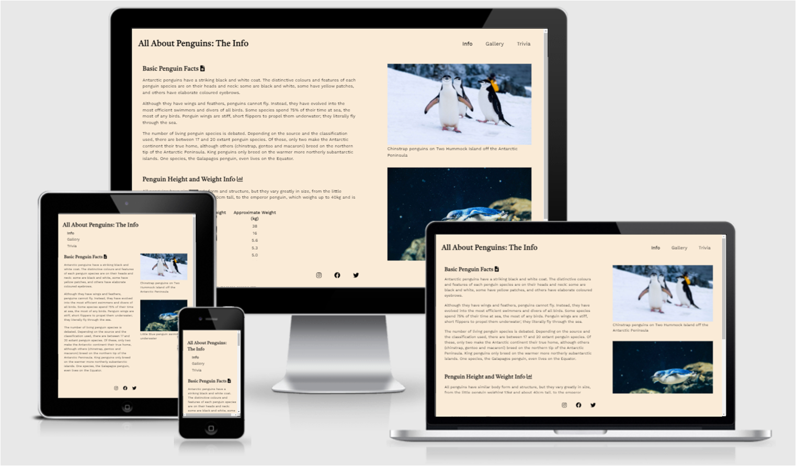

## Concept

The website has been developed to provide a solution for the following user stories and owner goals. User stories are focused around specific needs that users to an informational site are likely to have. Owner goals take into account why a potential owner could be interested in developing such a website.

### User Stories

- As a new visitor to the site, I want a site that is attractive, so that I enjoy using the site.
- As a new visitor to the site, I want a site that is easy to navigate, so that I can find what I need easily.
- As a returning visitor to the site, I also want a site that is easy to navigate, so I can easily confirm information that I have seen previously.
- For all users, I want to be able to access the site from whatever device and screen size I choose.
- As a user who is doing research for a presentation, I want a site that is clear and informative.
- As a user who is searching for trivia information (e.g., for a quiz), I want a site that contains interesting facts that are not necessarily well-known.
- As a user who is just browsing, I want a beautiful site that is easy to read with interesting information.
- As a user who is just browsing, I want a beautiful site with attractive images
- As a user who is particularly interested in and enjoys the subject matter, I want to enhance my knowledge.
- As a user who is particularly interested in and enjoys the subject matter, I want to be able to ask further questions to find out more.
- As a user who is particularly interested in and enjoys the subject matter, I want to follow the page on social media, so I can see more information about real-life experiences or updates to the site.

### Owner Goals

- As the site owner, I want to fulfil the needs and wishes of these users.
- As the site owner, I want to provide clear and accurate information.
- As the site owner, I want to provide an enjoyable experience for users.
- As the site owner, I want users to be able to access the site from any size of device.
- As the site owner, I want to obtain user feedback via a contact form.

## Design

The website was designed according to the five planes of content strategy. Using this structure provided a framework to develop the website. This is explained in more detail below.

### Plane 1: Strategy

The strategy of the website is largely defined by the user and owner goals listed above in the Concept section. The strategy is simply to provide solutions to the goals of the website's users and owners.

### Plane 2: Scope

The website includes the following information:
- An informational section for the user who is researching a project or who is particularly interested in the subject matter
- A gallery for all users, but particularly those with a special interest in the subject matter or who are just browsing
- A trivia section, for a user who is searching for interesting snippets of information for a quiz, particularly interested in the subject matter, or the user who is just browsing
- A contact form to ask about further information, for the user who is particularly interested in the subject matter

The following elements were considered but ultimately deemed to be out of scope of the current website. They could be added to a future version:
- Additional factual information about penguins: excluded because it could have led to 'information overload' with too much information for users to absorb
- A quiz for users to test their knowledge and win a prize: excluded because it is not effective to design a quiz with the HTML and CSS technologies used in this project; it would be better with JavaScript, which is beyond the scope of this project

### Plane 3: Structure

The website consists of three main pages, with a short fourth page.
- The landing page is also the main information page. It provides introductory basic facts about penguins, height and weight information and scientific classification information, along with two images to illustrate how penguins look both on land and underwater.
- The second page is a gallery page, containing a video that can be played by the user, another image and a photo collage.
- The third page combines the trivia information with a contact form. This is because users who are looking for more information in the trivia section but do not find what they are looking for are likely to want to fill out the contact form.
- The fourth page provides a message for users who have submitted the contact form, and redirects them back to the site's main page.

The website is multi-page to enable easier navigation. Navigation could be difficult if the whole website was placed on a single page since the amount of content on one page would become unwieldy.

### Plane 4: Skeleton

wireframes 

### Plane 5: Surface

#### Colour Scheme

A simple colour scheme is used to provide an attractive background to the website without detracting from the content. Since the website has a relatively large number of media items, it was important to select a neutral background colour that would fit well with a wide range of other colours.

#### Typography

The fonts are designed to be clear and easy to read, and again intended to be relatively neutral so that they do not take focus away from the content. A serif font for the headings and a sans serif font for the main website text provide a clear and aesthetically pleasing contrast.

#### Media

The pictures and video on the website were sourced from the stock photography sites [Pexels](https://www.pexels.com/), [Unsplash](https://unsplash.com/) and [Pixabay](https://pixabay.com/). The two images on the information page are selected to show penguins in their two main habitats, to provide as complete an overview as possible in a limited number of images. The images are all selected because they are clear, attractive and interesting, and are intended to show a range of different types of penguins in different group sizes and settings. The video provides a visual impression of a group of penguins; unfortunately no suitable videos were available with sound.

#### Presentation

The website is designed to maintain consistency of look and feel. For example, alignment is kept as consistent as possible within and between pages; sub-headings on all pages are always accompanied by Font Awesome images; images that do not fill the whole width of the viewport are displayed to the right of accompanying text, with any captions placed below the corresponding media. The style of writing and tone is also intended to maintain a consistent feel to the website.

## Features

### Titles

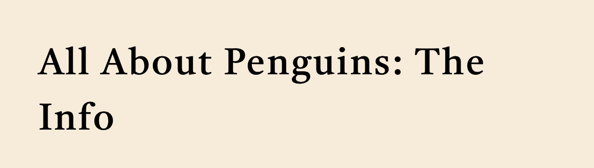

- Each page has a heading that provides the user with an instant overview of the type of content they can expect to find on that page.
- This allows the user to see at a glance what subject matter is addressed on each page.

### Navigation Bar

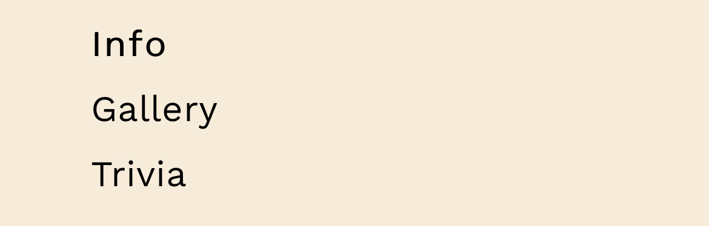

- Each page features a navigation bar, with the same keyword that is featured in the titles. This is identical between pages to allow for easy navigation.
- This provides consistency to the user and allows them to navigate quickly and intuitively between the different pages, on any device, without needing to use the ‘back’ button.
- The navigation bar appears as pictured below the main page headings on mobile; on larger screens above 1000 pixels it appears as a horizontal bar on the right-hand side of the page.

### Subtitles

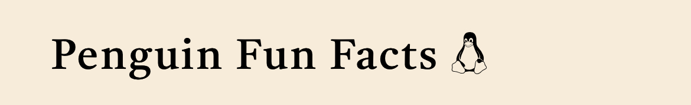

- Subheadings break the pages up into manageable and meaningful sections, to aid in within-page navigation and summarise their content.
- Each subheading is accompanied by a relevant Font Awesome icon, to decorate the text and provide an at-a-glance hint as to the subject matter of the section.

### Main Page

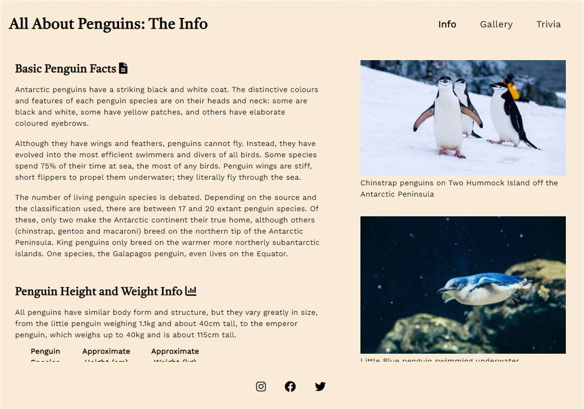

- The landing page begins with some basic free text information and images, followed by a table containing some data and scientific classification information.
- This section provides the user with plenty of information, while also featuring eye-catching images to draw the user’s attention.
- The page aims to present the most useful information first, i.e., key information about penguins with images to show the detail of what they look like. The information on penguin size follows to give supporting information. The scientific classification is important and should be included but may not be immediately meaningful to many users, so this appears at the end of the page.

### Gallery Page

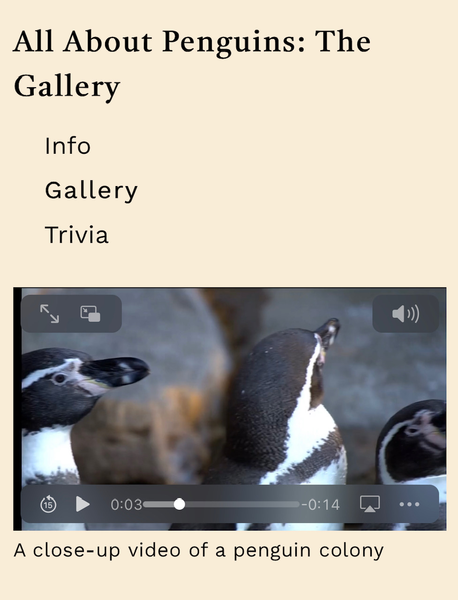

- This page begins with a video, to allow users to see penguin behaviour in motion.

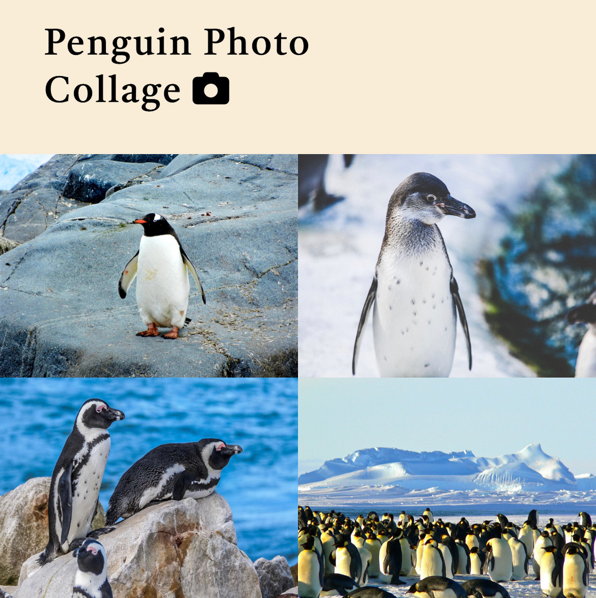

- The page also features plenty of images for users to enjoy and to learn more about the different types of penguins and what they look like. This includes a photo collage, which is designed using media queries to adjust in size based on the user's screen size, from 2 pictures wide on mobile devices up to 4 pictures wide on larger screens.

### Trivia Page

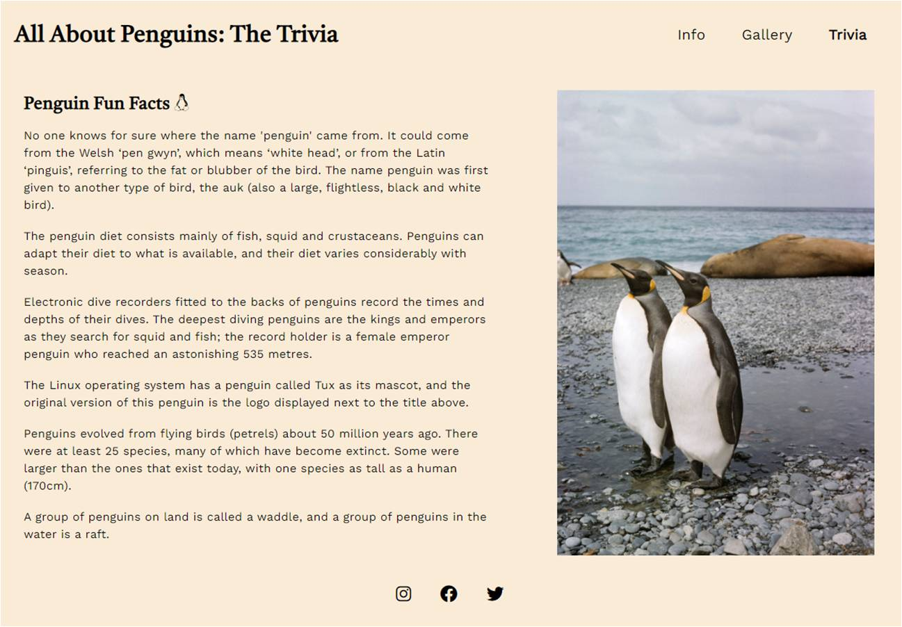

- This page features a trivia section, to provide interesting facts about penguins. 
- The trivia section is accompanied by further images to provide further information and add interest.

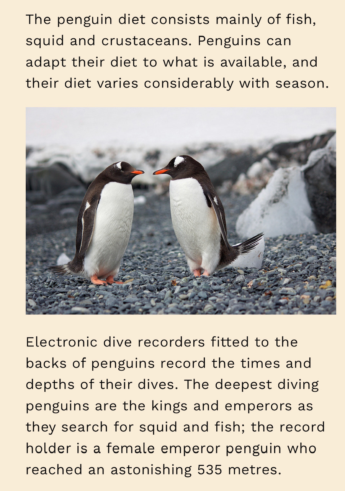

- On mobile devices, the "Fun Facts" section risks appearing overly long, with a large block of text in one go. To address this issue there is an image that displays on smaller screens only to break up the text.

### Contact Form

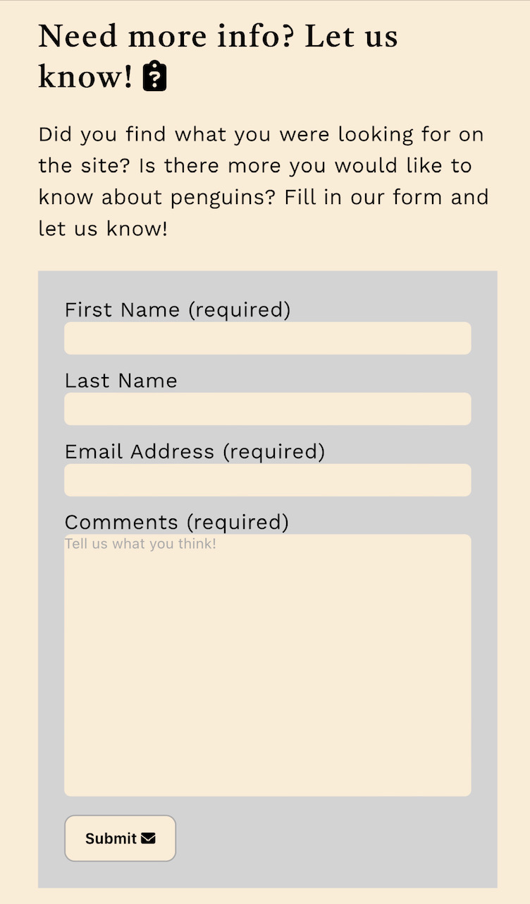

- The trivia page also includes a contact form, so that users can submit questions that are not already answered on the site.
- The form includes fields for a user to provide their first name, last name and email address, as well as a free text section for users to ask for more information.
- The user’s first name, email address and comments or questions are required fields on the form, so that questions can be received and a response can be correctly addressed and sent
- The last name is optional, since it is not necessary to collect this information in order to fulfil the purpose of the form. Some users may prefer not to provide their last name, and in some cultures people do not necessarily have both first and last names

### "Form Received" page

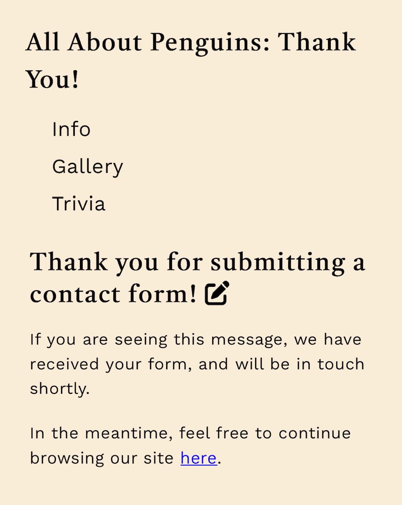

- This page is displayed when a user successfully submits a contact form.
- It displays some text to assure a user that their form has been submitted correctly and the data received.
- It is also designed to encourage users to spend further time on the site, by linking back to the main page in the thankyou text and including the normal navigation bar at the top of the page.

### Footer

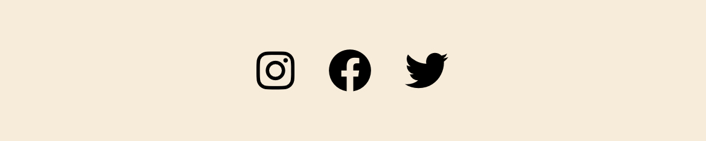

- The footer contains links to the social media sites for All About Penguins. So that the user can navigate easily, these links open in a new tab.
- These links are valuable to the user because they will be able to receive updates and find out more information via social media.
- Like the navigation bar, the footer is identical between the different pages. If a user initially does not click on a social media link but wishes to do so later while viewing a different page, this will allow them to find the link easily, without having to navigate between different pages.

### Features Left to Implement

As mentioned above, the following elements were not included at this stage but could be added to a future version:
- Additional factual information about penguins
- A quiz for users to test their knowledge and win a prize

## Technologies Used

### Languages

- [HTML](https://en.wikipedia.org/wiki/HTML)
- [CSS](https://en.wikipedia.org/wiki/CSS)

### Frameworks and Libraries

- [Balsamiq](https://balsamiq.com/)
- [GitHub](https://github.com/)
- [Pexels](https://www.pexels.com/)
- [Unsplash](https://unsplash.com/)
- [Pixabay](https://pixabay.com/)
- [Google Fonts](https://fonts.google.com/)
- [Font Awesome](https://fontawesome.com/)
- [Amiresponsive](http://ami.responsivedesign.is/)

## Testing

- Testing during coding took place by refreshing the browser preview in Chrome after each significant new section of code was written. Once the website started to take shape and especially as media queries were added, viewing the preview regularly on Dev Tools in Chrome was also important.

### Manual Testing

- Navigation: the following steps repeated on all pages
    - Verified that each navigation link redirects to the intended page
    - Verified that navigation links are correctly highlighted as active for the current page
    - Verified that the navigation links shift so that they are stacked vertically under the heading on smaller screen sizes

- Footer: the following steps repeated on all pages
    - Verified that each social media link redirects correctly to the homepage of the relevant social media site
    - Verified that on smaller screens below 750 pixels the footer does not remain fixed on the screen but appears only at the bottom of the content

- Video: Gallery page only
    - Verified that the user can play and pause the video as intended

- Contact form: Trivia page only
    - Verified that the form submits correctly and redirects to the "thankyou" page correctly when it is filled in as required
    - Verified that the form cannot be submitted without the required fields filled in
    - Verified that the form cannot be submitted without an email address (including an "@" symbol) in the email field

### Cross-Browser Testing

- Chrome was the browser used during the build phase of the website and so it has been extensively tested in Chrome

- Firefox: the website loads normally and adjusts as designed when the browser window is resized to tablet and mobile size. The video plays and pauses, the form can be submitted as designed and cannot be submitted with required fields left blank, and the internal navigation links work.

- Edge: the website loads normally and adjusts as designed when the browser window is resized to tablet and mobile size. The video plays and pauses, the form can be submitted as designed and cannot be submitted with required fields left blank, and the internal navigation links work.

- Safari: the website loads normally on the latest version of Safari on tablets, mobiles and desktops, though see note below in the Bugs section about older versions. The video plays and pauses, the form can be submitted as designed and cannot be submitted with required fields left blank, and the internal navigation links work.

### Validator Testing

- [W3C HTML validator](https://validator.w3.org/)
- [Jigsaw CSS validator](https://jigsaw.w3.org/css-validator/)

The website was also tested for accessibility using Lighthouse in Dev Tools, with the following results:

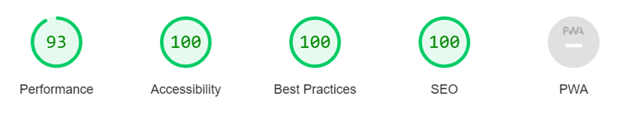

### Bugs

The following bugs were found during build and have been resolved:

- The contact form submit button was taking me to an error message code 501 instead of my form submission page.
    - I searched on Slack in case others had had the same issue and it turned out I hadn’t realised I needed to push the changes to Github before this would work.
    - After pushing the changes it still didn’t work initially but when I refreshed the browser to stop it using the cached version it worked perfectly.

- Form submission was subsequently providing a “405 Not Allowed” message on submission.
    - I discovered that this was because the form method was set to “POST”. While this is technically correct, it does not work here because the website does not have a functioning back end with a database for inputs to be posted to.
    - To fix this I have changed the form method to “GET” and added a note in the HTML to explain that this is done here as a fix only.

- Page titles and navigation menu are supposed to be vertically middle-aligned with each other on larger screens and were not ligning up correctly.
    - I tried using the CSS "vertical-align: middle" on both elements without success.
    - An internet search yielded [this article](https://www.w3schools.com/cssref/pr_dim_line-height.asp) and in particular the following entry in a table: “number: A number that will be multiplied with the current font-size to set the line height”.
    - Since my font size for the page title was set to 200% and for the menu was set to 125%, I added a { line-height: .5; } to the title and a { line-height: .8 } to the menu and it then started to work as intended.

- The bottom of the photo collage was jagged when viewed on all browser sizes, and I wasn’t able to think of a way to alter this through the CSS.
    - I initially tried making all the images the same height in pixels before uploading them to Gitpod, but this didn’t fix the issue.
    - I then altered the CSS to use flexbox styling for the container and set the maximum width of individual images within the container to 50% for small screens, 33% for medium screens and 25% for larger screens, which produced the desired result.

- The top alignment of the first two sections on each page on larger screens where they are adjacent to each other was not correct, with the right-hand section (an image) appearing slightly above the left-hand section (a block of text on the Info and Trivia pages, and a video on the Gallery page).
    - I had not noticed this after creating the Info page and before copying the html structure to the other pages because the effect is much less apparent when viewing the text + image than when viewing the video + image.
    - To fix this I created a table comparing the positioning declarations applied to each selector and found that the padding was not the same between the different sections. 
    - Adjusting the padding on the right-hand sections appeared the most likely adjustment that would not adversely affect the look of the rest of the website, and in some places would in fact have a positive impact.
    - This fixed the problem, although on first viewing it looks as though the right-hand section on the gallery page is slightly lower than the left-hand section. This appears to be because the video on the left is black at the top whereas the image on the right is light grey, creating a visual illusion of the image being lower than the video. When viewed with gridlines on the screen they are clearly aligned.

The following bugs remain unresolved:

- On smaller mobile screens there is an issue where it becomes possible to scroll the page horizontally when the screen is below a certain size, although the content is not wider than the viewport. This bug remains, since I have tried the following steps without resolution:
    - Inspecting the margins and padding applied to the page elements
    - Resizing all the images to make them smaller
    - Commenting out each line in turn of the CSS code in the media query section applied to the smallest-size screen
    - Tutor support (suggested resizing images and checking padding, both of which I have done)
    - Mentor support (mentor has been through the code with me on his own computer and has not been able to identify the source of the issue)

- On older versions of Safari the photo collage on the Gallery page distorts on all screen sizes. For example, viewed on an iPad Air running software version 12.5.5, the collage appears as follows:

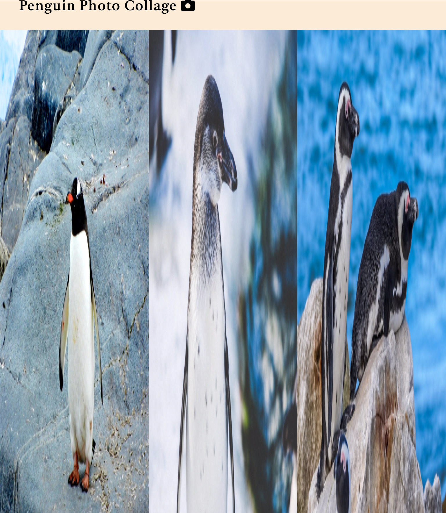

- However, on newer versions the photo collage appears correctly on all screen sizes. For example, viewed on a second generation iPad Pro running software version 15.4, the collage appears correctly:

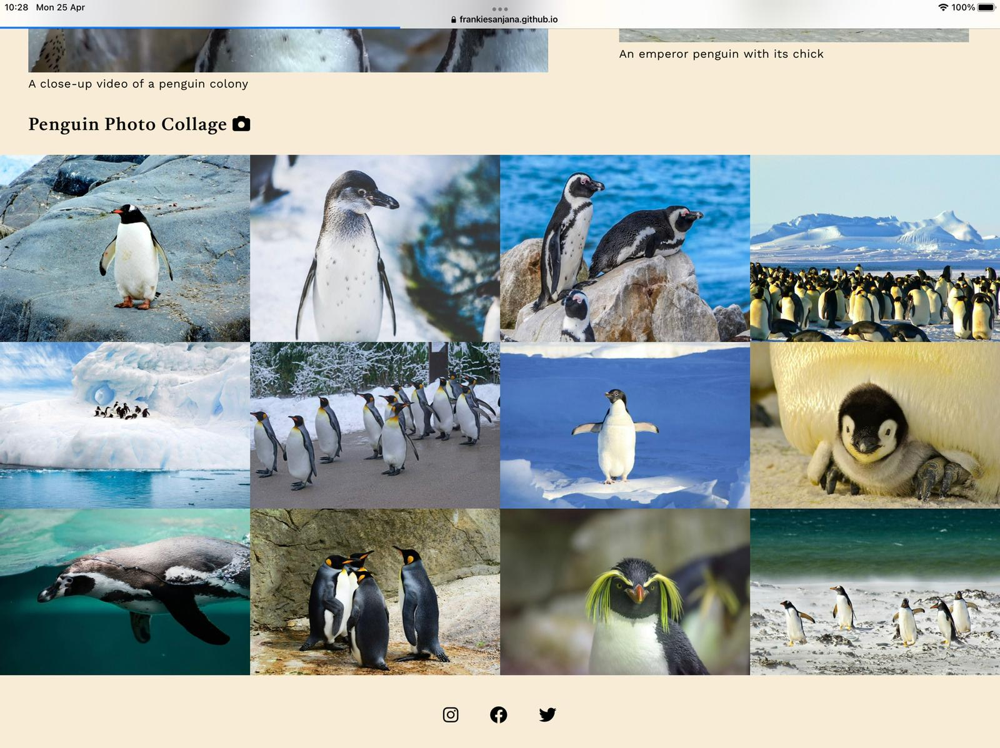

- This bug also remains, since I have tried implementing a number of CSS suggestions found online without success. There are also practical limitations to further testing even were I to be able to develop a further fix, because I do not personally own or use the devices running older versions of Safari that have encountered this issue, and it is known that installing Safari on a Windows machine is likely to work imperfectly even in the absence of bugs.

## Deployment

The website was deployed to GitHub Pages. The steps taken to deploy are:
- In the GitHub repository for the site, click on the ‘Settings’ tab along the top of the page
- This brings up a General Settings page with a selection of menu items down the left-hand side
- In this new menu, click on “Pages”
- In the main body of the page, it is then possible to select a branch. Select the main branch. Click on “Save”
- GitHub then provides a link to the published webpage, which can be clicked or copied and pasted like any other link

## Credits

### Content and Media

- The text in the website is taken from the website of the [British Antarctic Survey](https://www.bas.ac.uk/about/antarctica/wildlife/penguins/) (with permission) or rewritten using information found on the [Wikipedia Penguin webpage](https://en.wikipedia.org/wiki/Penguin).
- The pictures and video on the website were sourced from the stock photography sites [Pexels](https://www.pexels.com/), [Unsplash](https://unsplash.com/) and [Pixabay](https://pixabay.com/)

### Code and Coding Guidelines

- The only two pieces of code that are copied from elsewhere are as follows:
    - The code to import Google Fonts for use in all text in the website body is taken from [Google Fonts](https://fonts.google.com/).
    - Script and icon code for Font Awesome icons that accompany subheadings is taken from [Font Awesome](https://fontawesome.com/).

- However, while researching and writing my project I also referred to the following resources:
    - The [W3schools website](https://www.w3schools.com/), in particular the sections on HTML and CSS.
    - The Love Running project on [Code Institute](https://codeinstitute.net/).

### Other Credits

- The Code Institute GitPod [template](https://github.com/Code-Institute-Org/gitpod-full-template) on GitHub was used to create my repository for this project.
- [Balsamiq](https://balsamiq.com/) was used to develop wireframes for the project.
- Thanks to Ed Stanley and Lorna Wilson for Safari testing and feedback.